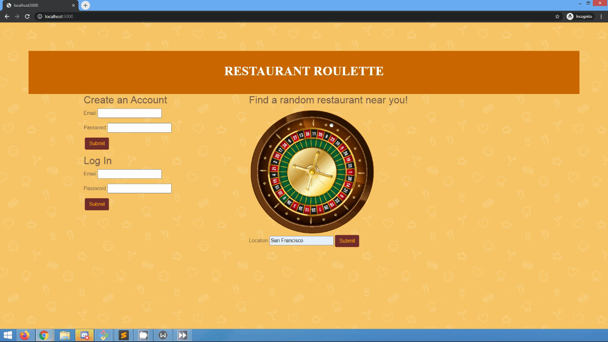

# Restaurant Roulette 

Restaurant Roulette generates a random restaurant based on the location that a user inputs and has the ability to add a restaurant to their favorite list as well. 

## Technologies 

* Python 
* Flask 
* PostgreSQL
* SQLAlchemy
* HTML 
* CSS
* Bootstrap
* JavaScript (AJAX, JSON)
* jQuery 
* Yelp API 

## Features 

#Homepage 

User enters city or zip code in location field 



## Installation 

* Clone the repo to your local machine: 
```python
https://github.com/acai128/Restaurant-Roulette.git
```
* Sign up to use the [Yelp API](https://www.yelp.com/developers/documentation/v3/get_started)
* Save your API key in a file called secrets.sh using this format: 

```python
export YELP_KEY="YOUR_KEY_HERE"
```

* Create a virtual environment, activate it, and install the project's dependencies from requirements.txt 

```bash
$ virtualenv env
$ source env/bin/activate
(env) $ pip3 install -r requirements.txt
```
* Execute secrets.sh to load YELP_KEY into environment 

```bash
$ source secrets.sh
```

* create database called restaurant 

```bash
createdb restaurant
```

* run python3 server.py to start server and open http://localhost:5000 in your browser

```bash
$ python3 server.py
```

